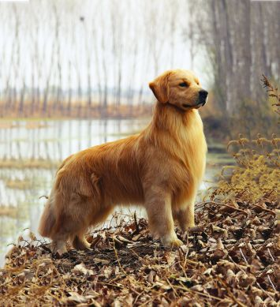
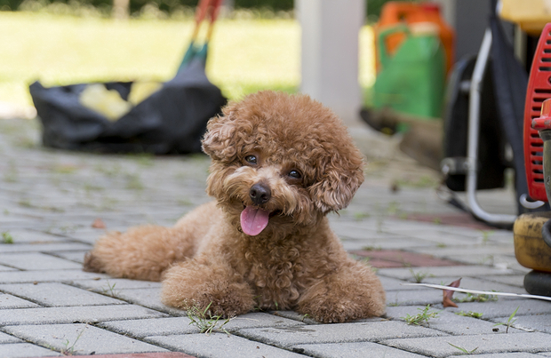

## Project Overview

This project detects the breeds of dogs in images, based on Convolutional Neural Networks (CNN) and Transfer Learning. It achieves an accuracy rate larger than 80%. This project is part of Data Science Nano Degree(DSND) by [Udacity](https://www.udacity.com/).

## Problem Definition

Given an image of a dog, predict the breed of it! There are total **133** categories of breeds in this problem set. For example, images could be containing golden retriever or poodle!

A baseline is predicting by random guess. Since there are **133** breeds in this problem, it should get an accuracy around 1%. But we are expected to do much better.

## Method

Previously we have learned Deep Neural Networks (DNN) where a layer of neurons are fully connected to every neurons in previous layer. There are some problems associated with this method when we apply it to image recognitions:

1. The image data has to be reshaped to 1D vector.

2. The object to detect has to be located at a fixed position so that this DNN method could perform well.

3. There will be a huge amount of parameters to train while a big chunk of them are NOT directly useful if the image matrix is sparse. 

Now with Convolutional Neural Networks (CNN), these problems are addressed. It implements Convolutional Kernels in each layer, which is both locality insensitive and training efficient. What is more, it has a much more robust performance in image recognitions. To learn more about CNN, refer to Stanford [CS231n](http://cs231n.github.io/convolutional-networks/)

## Implementation

In practices, CNN usually extracts the visual patterns from images, like shape of eyes and ears, with a multiple of CNN layers working progressively. A pooling layer is usually appended to each CNN layer to help reduce the dimensions. Fully connected layers are implemented on top of CNN layers to summarize the visual features captured and help predice the category of input images.

Fortunately, there are already well-trained CNN models that extracts the visual features well enough. For instance, [AlexNet](https://en.wikipedia.org/wiki/AlexNet), [VGG](http://www.robots.ox.ac.uk/~vgg/research/very_deep/), [ResNet](https://en.wikipedia.org/wiki/Residual_neural_network), [Inception](https://towardsdatascience.com/a-simple-guide-to-the-versions-of-the-inception-network-7fc52b863202) are models that won [ImageNet](http://www.image-net.org/) competitions during past years. We could save the hussles and directly implement one of them in our model.

What remains is fully connected layers where all these visual features are summarized and used to catergorize the input images depending on difference applications. Here we implement transfer learning to combine the pretrained model and customized layers. This achieves a high accuracy and cut down training cost at the same time.

All algorithms are implemented with Python3 and [Keras](https://keras.io/).

## Evaluation

With pretrained Inception model [InceptionV3](https://github.com/keras-team/keras-applications/blob/master/keras_applications/inception_v3.py) in keras and training on 6680 dog images, an accuracy > 80% is achieved on the test dataset of 836 images.

## More details

A blog post of this project is available [here](https://xuemeng-zhang.com)
